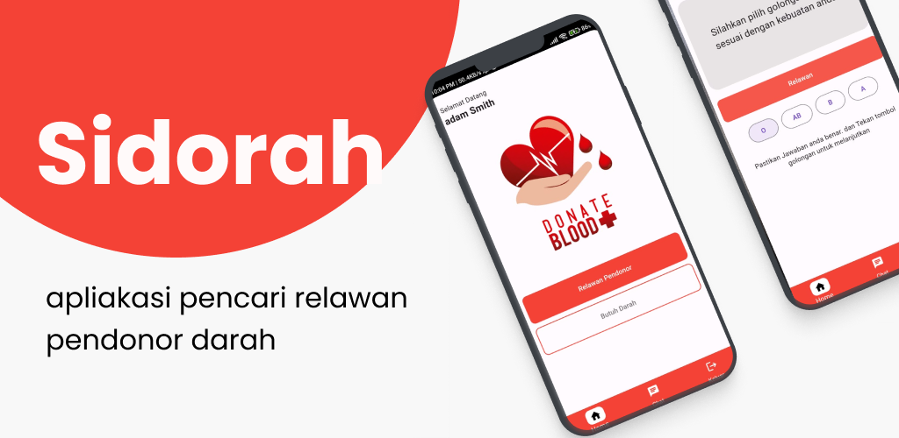

# Donor Darah

 

Sebuah proyek Flutter untuk membantu pengguna dalam mencari dan mendonasikan darah.

## Getting Started

Ini adalah titik awal untuk sebuah aplikasi Flutter. Berikut adalah langkah-langkah untuk memulai proyek ini:

### Prerequisites

Sebelum memulai, pastikan Anda sudah menginstal hal-hal berikut:

- [Flutter SDK](https://flutter.dev/docs/get-started/install) versi terbaru
- [Android Studio](https://developer.android.com/studio) atau [VS Code](https://code.visualstudio.com/) sebagai editor kode
- [Git](https://git-scm.com/) untuk cloning repository
- Emulator Android/iOS atau perangkat fisik yang terhubung

### Cara Menjalankan Aplikasi

1. **Cloning Repository**
   
   Clone repository ini ke komputer lokal Anda dengan perintah berikut:

   ```bash
   git clone https://github.com/username/donor_darah.git

2. **Masuk Folder**
 
 ```bash
    cd donor_darah

3. **Jalankan**
    
    ```bash
    flutter pub get

4. **Selanjutnya **
    
    ```bash
    flutter run


